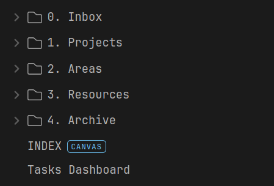
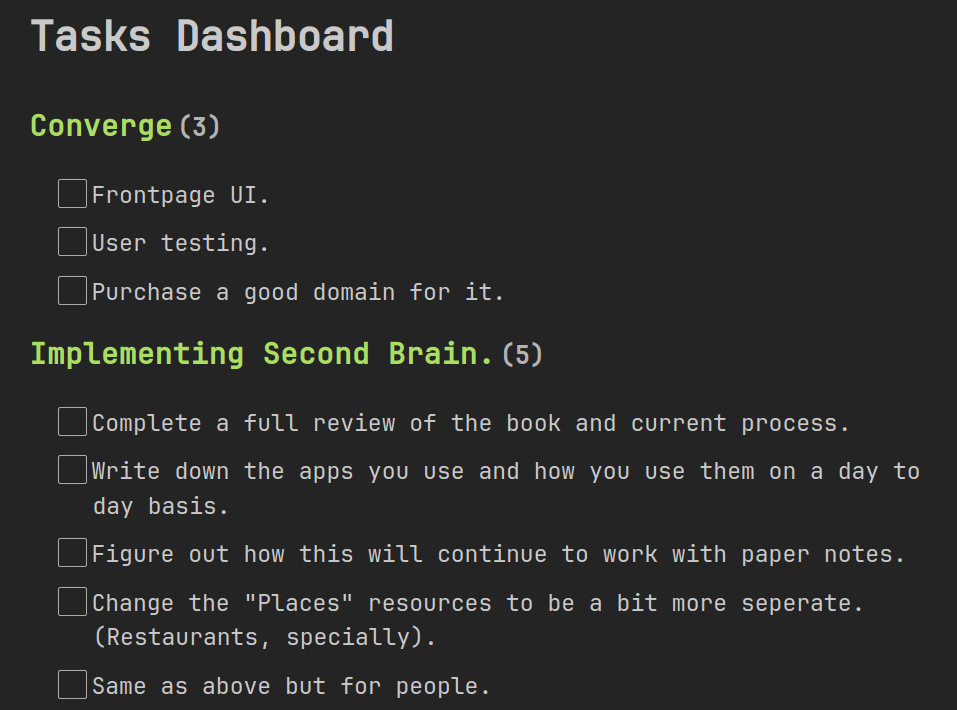
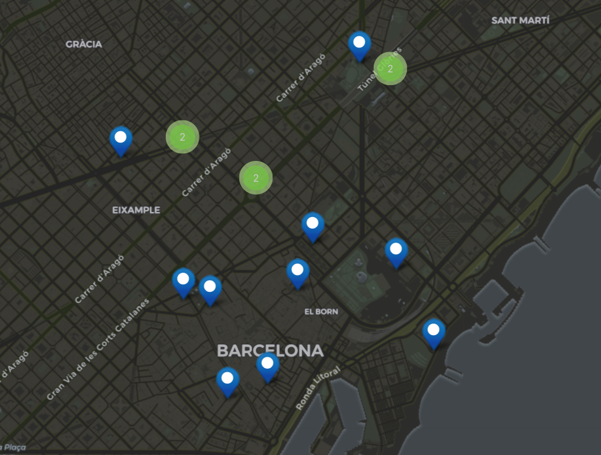

+++
title = "Build a Second Brain - Tiago Forte"
date = "2024-06-06"
author = "John Costa"
toc = true
tags = ["books", "productivity"]
+++

Now more than ever, people have to manage incredible amounts of information, and recall it at a moments notice.

The cheer amount of data that most of us consume in our work and lives is the highest in human history.

Tiago Forte's book _Building a Second Brain_, explains the need for a second brain, as well as guides into how you would implement your own system.

# What is it?

A second brain is not a thing but a system. It is the collection of tools you use to store, organise and recall information from. It is also the information stored on those tools.

# Why do you need it?

The famous quote from David Allen (Author of Getting Things Done) _'Your mind is for having ideas, not storing them'_. You should not have to store all the information you deal with in your everyday life in your head, you simply won't be able to.

So we need to come up with a system to help us keep track of all the information, so that we can build on it and produce work from it.

# The Second Brain Methodology

## CODE (Capture, Organise, Distil, Express)

Forte explains that the process you should take when using your Second Brain, is the following:

## Capture.

Write down things that you _vibe_ with, things that catch your interest or things that you think will be nice to look back on at a later time.

Forte mentioned _The moment you first encounter an idea is the worst time to decide what it means_. This stayed with me because it is very true, you often encounter things, make the decision that it is not important, and then move on with your life. Just to think about it in a week's time and having no idea where you found it.

You should capture things that make you stop and thing slightly. They will come back and be useful at some point.

Forte mentions an idea from Richard Feynman, who said he keeps around 12 interesting problem floating around his head. Forte encourages you to sit down and think about what these problems are, and when you see something that loosely relates to one of them, you should capture it.

Here are some of my interesting problems.

- How can I work after my day job, without being tired or unmotivated?
- How can I be the best engineer I can possibly be?
- How to spend quality time with friends and family.

Perhaps mine are a bit too specific, but they are specific to my life, you might want to consider more broad problems instead.

## Organise. The PARA system.

PARA (Projects, Areas, Resources and Archive), is the _folder_ system Forte recommends.

### Projects

A folder containing all your active projects, from all areas of your life. This serves the main place in your second brain that you interact with day to day because it contains the most _actionable_ information, as well as actual pieces of work.

### Areas

More high-level than projects, these serve as things in your life that you actively thing about but aren't projects. Some examples are:

- Finances.
- Hobbies / Sports (For me this is Judo).

Although these are not projects, they are things you probably think about quite frequently, and therefore deserve to have a folder to contains various bits of information.

It is also often from here that projects spawn from, as you develop a more specific interest or goal from one of these areas.

### Resources

Reference material. Information that you don't think about but information that needs a place to live. You can store pretty much anything here, as long as it is somewhat relevant to your projects or areas, or you think it will in the future.

Here are some of my resources:

- Books and Authors
- Restaurants
- Quotes
- Daily Notes

It is very general, and what I found myself doing is going through the folders inside _resources_ for inspiration, and thinking about how I can _distill_ this information into an interesting piece of work, or how I could use it in my current projects.

### Archive

Everything you don't need to look at, probably ever again. However, you _might_, so it is important to not delete it, just in case you need to look back at some stuff.

It is also important because it gives you motivation to keep going. All your finished projects will end up in the Archive, and if you are ever feeling down or unproductive, you can look back in your archive to see how far you've come.

The archive is also where I started my more structured second brain. I dumped every file I had in the Archive, and slowly took things out, and realised how many things I did not need to have lying around.

## Distil

The previous two sections were fairly familiar to me, even if I didn't use the PARA system, I had _a_ system.

But what my previous system was very bad at was enabling me to _Distil_. The process of distilling something means looking at current information and breaking it down into smaller, more easily consumed chunks, so that your future self can look back and not have to do much work.

Forte offers a technique called _Progressive Summarisation_, where you highlight a bit of raw source material (let's say a Wikipedia article), and you highlight the bits that are relevant, and then do it again. Until you have a very concise sentence of two which captures the entire article.

## Express

Take your work, and create something presentable out of it. It is interesting to me that Forte choose to add this step as part of the process and not as a side-effect. But the more I thought about it, the more it made sense.

Expressing your work is a crucial part of learning. One of the best ways to become better at something (at least for me), is to teach it to someone else. Not only that but other people might have incredibly valuable insights into your work and will help you make it better.

There is only so much you can do when working alone, so it is important to share your work, and help others, and get help from others.

# My Own System

I've talked about the book as a whole and the key lessons I have taken from it (although I have omitted some). I will now show you what my own system looks like.

## [Obsidian](https://obsidian.md)

This is the champion of the entire system. I use other tools but this contains most information.

There are two reasons why I choose Obsidian, not only as the best option, but in many ways _the only option_.

### 1. My Data

Obsidian works on Markdown files (.md), which is a common, plain-text format. It has enough features to create rich text, and it is light enough so that it doesn't annoy me.

But the important thing is that these are my files, and they are no one elses, I have ownership over them, and can at any point transfer them to another app if I wanted to, of even edit the raw files themselves, I am not stuck to Obsidian, which in many ways is why I choose to use Obsidian.

The other side of this is that I setup my own syncing solution using [Syncthing](https://syncthing.net) so that my laptop, tablet, desktop, phone and server all have the same files.

### 2. Community Plugins

The eco-system around Obsidian is increbible, and the plugins turn Obsidian into a complete solution for your second brain system.

Here are some that I use.

- [Dataview](https://blacksmithgu.github.io/obsidian-dataview/)
- [Mapview](https://github.com/esm7/obsidian-map-view)
- [Checklist](https://github.com/delashum/obsidian-checklist-plugin)

A really powerful thing you can do with Dataview, is bringing tasks from across various files.

This alone means that I no longer need a todo app or a project manager, because this is plenty for me.

Mapview is also really useful so I can store all the places I have been to, and check what I thought about them. Here is an example from a recent trip to Barcelona.

## [Raindrop](https://raindrop.io)

This is my bookmark manager. Whenever I go on a web page that I find interesting, I bookmark it to look back on later.

Whilst Obsidian acts as my box of information for more abstract things, Raindrop is the system I use to store websites and links.

It is very useful to then look back on them later, and mostly I organise and sort through my Raindrop when I'm out and only have my phone to keep me entertained. There I can read things I saved for later and sort links into certain folders.

## Physical Notebook

Along with all the digital tools, I also use an A5 notebook as my day book. Every day I write the date and day on the top of the right hand side page, and use that page and the one on the left, to keep notes about the day, more important tasks and anything I find cool.

This is a life saver during workdays, because I often have to juggle a lot of information, so it's good to keep a physical list I can look at.

It is also very useful to look at the previous days, to check what you got through.

## Other Tools

There are many others I use to get work done, but they are less specific.

- GitHub - Keeps all my code.
- OBS - Software for screen recording and streaming.
- Arch Linux + KDE - My OS of choice, most of the defaults here are sensible and I find myself using KDE apps for a lot of things (PDFs, screenshots, etc...).
- Syncthing - For keeping Obsidian in sync.

# Conclusion

This book was extremely useful. It not only explains the need for a good system, but it is an incredible guide as to how someone can build this system.

Forte is a very good writer, with many practical chapters focused directly at getting your work organised, with just the write amount of more abstract chapters to discuss the concept of a second brain.

I highly recommend you read it yourself, even if you skip a bunch of chapter to just look at CODE, this is the best resource to learn about it.

Rating: 8/10. e
